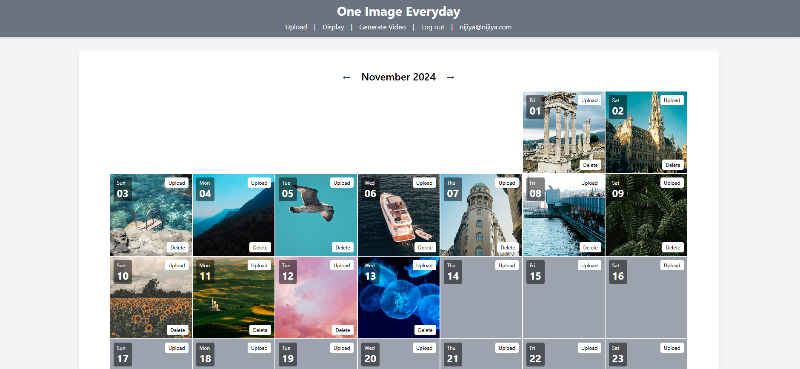
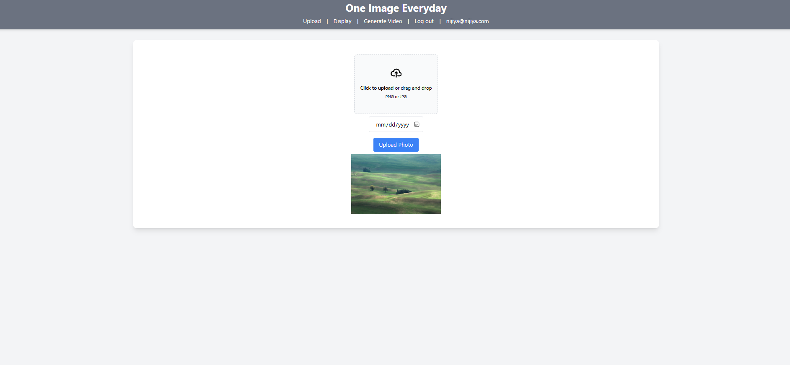
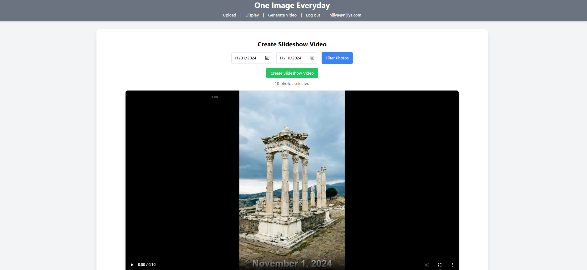
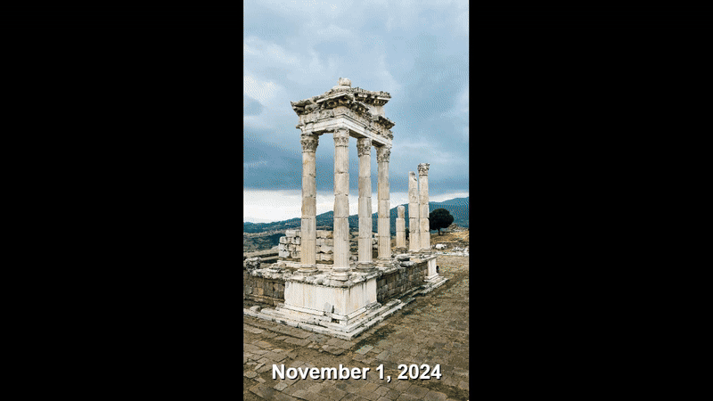

# One Image Everyday

**One Image Everyday** is a web application that allows users to upload a photo each day, track their photos over time, and view them in a calendar view. The app includes features for uploading, viewing, and deleting images, along with captions to add context to each photo. This project is designed to help users document and reflect on their daily lives through images.

## Features

- **Image Upload:** Users can upload images for a specific day and view uploaded images in a grid format.
- **Video Generation:** Users can generate a video from uploaded images for any time interval.
- **User Authentication:** Secure login and authentication system for users.

## Technologies Used

- **Frontend:**
  - React.js (with hooks)
  - Axios (for API requests)
  - Tailwind CSS (for styling)
  - React Router (for navigation)

- **Backend:**
  - Node.js with Express
  - MongoDB (for storing images and metadata)
  - JWT-based Authentication
  - FFmpeg (for video generation)

## Usage

1. **Sign Up/Log In:**
   - Navigate to the login page and either sign up or log in if you already have an account.

2. **Upload Image:**
   - Select a date and upload an image.
   - Add a caption for the image.
   - Submit the form to upload the photo.

3. **View Images:**
   - You can see the images you’ve uploaded for each day in the display section of the app.

4. **Edit/Overwrite Image:**
   - If a photo already exists for the selected date, you have the option to overwrite it by uploading a new image.

5. **Delete Image:**
   - You can delete any image you’ve uploaded by selecting the delete option.

## Screenshots

Here are some screenshots showcasing the app:

### 1. **Display Section**
   

### 2. **Image Upload Section**
   

### 4. **Video Section**
   
   
